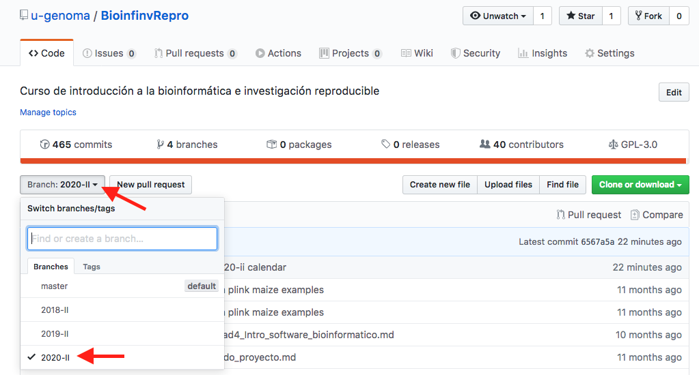
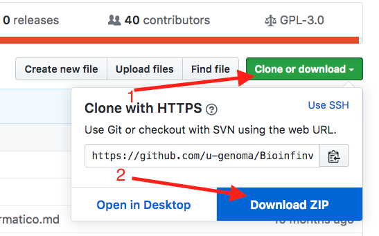

# Introducción a la bioinformática e investigación reproducible para análisis genómicos

Mediante una colaboración entre el Posgrado en Ciencias Biológicas de la Universidad Nacional Autónoma de México, CONABIO y la U. de Chile, ofreceremos un curso intensivo de bioinformática, orientado a entregar las herramientas básicas para análisis de datos genómicos en el contexto de genética, especialmente la genética de poblaciones.

INSTRUCTORES:

**Dra. Alicia Mastretta Yanes, PhD.**
Catedrática CONACYT-CONABIO,
[www.mastrettayanes-lab.org](www.mastrettayanes-lab.org)

**Dra. Camille Truong, PhD**.
Investigadora Instituto de Biología, UNAM
[camilletruong.wixsite.com](https://camilletruong.wixsite.com/home#!)

**Verónica Reyes Galindo**
Estudiante doctorado Intituto de Ecología UNAM - CONABIO

**Dr. Ricardo Verdugo Salgado, PhD**
Profesor Asistente, Programa de Genética Humana, ICBM, Facultad de Medicina, U. de Chile, [http://genomed.med.uchile.cl](http://genomed.med.uchile.cl)

Los materiales aquí presentados son de acceso libre. La transmisión online y videos de clases se pueden encontrar en [este canal de Youtube](https://www.youtube.com/channel/UCqrgi3eXb3J51QMO0LQrgOA)

Sala de chat para **anuncios de la clase** y dudas si lo estás viendo remotamente: [en Gitter](https://gitter.im/Bioinfo_Mx-Cl/community)

## Objetivos

El **objetivo general es** brindar a los y las alumnas las herramientas computacionales de software libre, mejores prácticas y metodologías de reproducibilidad de la ciencia para efectuar, documentar y publicar proyectos bioinformáticos de análisis genómicos.

Los **objetivos particulares** son:

1.	Formar a los y las alumnas en los principios de investigación reproducible y metodologías para organizar proyectos bioinformáticos
2.	Introducir a los alumnos a bash, R y git
3.	Presentar a los alumnos los tipos de datos genéticos producidos por la secuenciación de siguiente generación
4.	Introducir a los y las alumnas al análisis e datos genómicos y genomas reducidos
5.	Revisar  a  nivel teórico y  práctico los  métodos  bioinformáticos  clásicos  de  análisis secuencias genómicas
6.	Asesorar a los alumnos en la realización de sus propios proyectos bioinformáticos

### Que sí es este curso

* Una introducción a los métodos y mejores prácticas de la biología computacional, los análisis bioinformáticos y la ciencia reproducible.
* Un resumen general de los tipos de datos utilizados en genómica y las herramientas computacionales para analizarlos.
* Una introducción para saber utilizar la línea de comando y R de forma fluida a través de mucha práctica. **Muchos cursos enfocados en análisis de datos genómicos asumen que ya sabes esto, o dan una introducción flash y luego saltan al otro tema, lo que hace  _muy difícil_ realmente aprovechar el otro tema o te deja con malas prácticas difíciles de borrar.**
* El lenguaje para aprender a entender los manuales de cualquier software bioinformático para poder utilizarlo a fondo por cuenta propia.
* Un curso con mucha práctica de R enfocado en ciencia reproducible, limpieza y graficación de datos biológicos y genéticos.
* El piso básico para poder tomar un curso más avanzado o adentrarse por uno mismo en algún análisis concreto (ensamblado de genomas, análisis transcriotómicos, filogenética con métodos Bayesianos, etc).

### Que NO es este curso

* La respuesta a qué tienes que hacer en tu proyecto de tesis.
* Una discusión profunda de los diferentes softwares para analizar datos GBS, RAD, genomas, transcriptomas, metabarcoding, etc.

En otras palabras en este curso no te vamos a decir qué programa utilizar ni discutir a profundidad métodos de ensamblado etc. Para eso hay cursos especializados intensivos de un par de días que asumen ya sabes usar chido la terminal.

Algunos ejemplos:

* [Curso Bioinformática Instituto de Biotecnología, Cuernavaca](http://uusmd.unam.mx/curso/).
* [Talleres Internacionales de Genómica del Centro de Ciencias Genómicas, Cuernavaca](http://congresos.nnb.unam.mx/TIB2017/)

## Dinámica del curso

### ¿Cómo serán las clases?
* Exposición + ejercicos y ejemplos en clase
* Todos los materiales de la clase los iremos subiendo/actualizando a GitHub conforme avance el semestre
* Dejaremos **lecturas** a casa antes o después de algunos temas. Es una muy buena idea sí leerlas.
* Ocuparemos Google Classroom para enviar tareas y hacer anuncios del curso. Debes recibir una invitación a tu correo.

* **¿Necesito una computadora?**

El curso es teórico-práctico, por lo que se requiere traigan su laptop con Mac o GNU/Linux (**no** Windows, sorry, lo intenté 2 años y es una pesadilla para todxs) y:

  -  [Docker](https://www.docker.com/) instalado y **FUNCIONANDO** (ocuparemos Docker dentro de un mes)

* **¿Necesito instalar algo más? Sí**
     1. Un editor de texto decente. Listo para la 2da clase. Recomendaciones:
         * Mac o Linux: [Atom](https://atom.io/)
         * Linux: [Gedit](http://sourceforge.net/projects/gedit/) u otro que te guste.
     2. Un editor de Markdown    
         * Mac: [MacDown](http://macdown.uranusjr.com/)
         * Mac o Linux: [Haroopad](http://pad.haroopress.com/) o [Typora](https://typora.io/)
     3. [R y RStudio](https://www.rstudio.com/products/rstudio/download/).

     
 **Si van a tomar notas, que sean ahí o en un editor de Markdown, nooooo en Word, de veritas de veritas**.
 

También necesitas abrir una **cuenta de Github** para unirte al 

### Este repositorio

El repositorio está dividido en un folder por Unidad. Dentro de cada folder subiremos los apuntes y código utilizado en cada clase conforme los vayamos viendo en el semestre, así como los enlaces a las tareas.

Las notas de este repositorio están escritas en formato **Markdown** y, como notarás, el repositorio se encuentra hospedado en **GitHub**.

Cubriremos ambas herramientas en el curso, pero en resumen:

* Markdown es un procesador texto-a-HTML que de forma sencilla permite formatear texto `así`. Esto es útil para resaltar los los comandos y los resultados de la terminal del resto del texto en los documentos de clase (y en foros de ayuda).

* GitHub es un repositorio web especializado en software (pero se puede subir cualquier texto, como este). La parte de arriba enlista los archivos y carpetas dentro del repositorio. La nota de texto a su derecha es el comentario que yo realicé al subir o modificar (*commit*) el archivo de mi computadora a GitHub. En la parte de abajo puedes leer el contenido de dichos archivos en formato html. Y si los bajas los verás en formato Markdown.

En este mismo repositorio de github están las versiones de cursos que hemos dado los años pasados. Cada curso está en una "rama" de del repositorio (más adelante veremos qué es esto). Si estás siguiendo este curso en youtube en un año diferente al del curso, quizá sea necesario que cambies la rama para que los videos correspondan con los apuntes.

En la unidad 2 aprenderemos a utilizar github desde la línea de comando, pero por lo pronto, para hacer los ejercicios de la unidad 1: baja el respositorio y guárdalo en tu escritorio. Para bajarlo da click en el botón vere del lado derecho que dice "Clone or Download" y selecciona "Download zip".

### Mecanismo de calificación

El curso se dividirá en secciones que se calificarán por separado:

**Unidades 1-3:**

* 70% Tareas. Aproximadamente una tarea por sesión. Todas las tareas tienen el mismo valor. Habrá tareas opcionales, que se suman a la calificación esta sección
* 20% Examen
* 10% Asistencia (física o virtual) y participación 

**Unidad 4-5:**

* 10% Tareas. Todas las tareas tienen el mismo valor. Habrá tareas opcionales, que se suman a la calificación esta sección.
* 90% Proyecto de la Unidad 5, el cual se califica con:
	* 10% Organización del repositorio
	* 15% README **(debe ser en inglés)**
	* 20% Análisis
	* 10% Resumen y discusión en formato Markdown 
	* 15% Gráfica(s) en R
	* 15% Scripts **deben estar comentados en inglés**
	* 15% Avances preliminares 

**Unidad 6-9:**

100% Tareas. Aproximadamente una tarea por sesión. Todas las tareas tienen el mismo valor.

**Proyecto final**

* 10% Organización del repositorio
* 15% README **(debe ser en inglés)**
* 20% Análisis
* 10% Resumen y discusión en formato Markdown 
* 15% Gráfica(s) en R
* 15% Scripts **deben estar comentados en inglés**
* 15% Avances preliminares

Para Chile, las unidades 1-4 y 6-9 constituyen dos cursos independientes. La Unidad 5 y el proyecto final son opcionales.

Para México, todas las unidades y el proyecto final son obligatorios.

**Copiar o plagiar (tareas, exámenes, trabajo final, lo que sea) es motivo suficiente para reprobarte sin lugar a discusión.**

## Temario

[Video de Bienvenida al curso 2020](https://www.youtube.com/watch?v=51y4PLN2mBY)

#### Unidad 1 [Introducción a la programación](Unidad1/Unidad1_Intro_programacion.md)
[Video **Sesión 1:  Introducción al código y la terminal**](https://www.youtube.com/watch?v=vziA1KbShoQ)

* Código en computación
* Cómo buscar ayuda (permanentemente)
* Introducción a la consola y línea de comando de bash y R
* Funciones básicas de navegación y manejo de archivos con bash

[Video **Sesión 2: Introducción a los scripts y grep**](https://www.youtube.com/watch?v=ppqsw1OVw_0)

* Funciones básicas de exploración de archivos con bash
* Regular expressions y búsqueda de patrones (grep)
* Redirección con bash

[Video **Sesión 3: Continaución de bash**](https://www.youtube.com/watch?v=OhCBraaRfKs)

* Introducción a los scripts
* Loops con bash

[Video Extra: Volver ejecutable un script](https://www.youtube.com/watch?v=wp3eC7FVANg)

#### Unidad 2 [Organización de un proyecto bioinformático](Unidad2/Unidad2_Organizacion_proyecto_bioinf.md)

[Video **Sesión 1: Documentación bioinformática**](https://www.youtube.com/watch?v=N_KUce2siNo)

* Documentación de scripts y del proyecto
* Markdown
* git

[Video **Sesión 2: Github**](https://www.youtube.com/watch?v=NIZjzU1BTjc)

* Manejo de proyectos e issues en Github
* Creación de pipelines

#### Unidad 3 [Introducción a R con un enfoque bioinformático](Unidad3/Unidad3_Intro_a_R.md)

[Video **Sesión 1: Introducción a R**](https://www.youtube.com/watch?v=MIzdokGuw_E)
[Video **Sesión 1: Introducción a R-CONTINUACIÓN**](https://www.youtube.com/watch?v=J2rGmyOMBJI)

* R y RStudio
* Funciones básicas de R más importantes para bioinformática

[Video **Sesión 2: Rmrkown y Funciones en R**](https://www.youtube.com/watch?v=98AaKGzfdCw)
* Continuación intro
* Funciones propias: crear funciones y utilizarlas con source
* Rmarkdown y R Notebook

[Video **Sesión 3: Manipulación y limpieza de datos en R**](https://www.youtube.com/watch?v=cvTvySyvG-s)

* Manipulación y limpieza de datos en R

[Video **Sesión 4: Graficar en R**](https://www.youtube.com/watch?v=3LSx8cdx2Do)

* Graficar en R

[Video **Sesión 5: Bioconductor**](https://www.youtube.com/watch?v=hTGqqeZomVM)

* Bioconductor

#### Unidad 4 [Introducción a software especializado y uso de servidores remotos](Unidad4/Unidad4_Intro_software_bioinformatico.md)

[Video **Sesión 1: Software especializado y servidores remotos**](https://www.youtube.com/watch?v=YpD1n-Fzomk)

* Introducción a Software especializado y cómo instalarlo
* Uso de servidores remotos

#### Unidad 5 [Genética de poblaciones con software especializado](Unidad5/Unidad5-Pop_genetics_software_especializado.md)

[Video **Sesión 1: genética de poblaciones con software bioinformático**](https://www.youtube.com/watch?v=Gdxwh2oSkOY)

* Formatos VCF-tools y plink
* Paquetes de R y otros software para genética de poblaciones

[Video **Sesión 2:coninuación de genética de poblaciones**](https://www.youtube.com/watch?v=uvomUe2Ju_k)

* PCA exploratorios
* Análisis básicos de diversidad y diferenciación genética

#### Trabajo en casa en proyectos finales y tareas
 Se dará seguimiento online al proyecto de las unidades 1-5 con las herramientas de la Unidad 2 y se dejarán tareas para mantener la práctica de las unidades anteriores

#### Unidad 6 [Introducción a la genómica y secuenciación de siguiente generación](Unidad6/Unidad6_IntroGenomica_NexGenSeq.md)

**Sesión 1 Generación y alineamiento de datos NGS**

* Técnicas de secuenciación
* Errores de secuenciación
* Formatos fastq, bam, vcf
* Análisis básicos de calidad

**Sesión 2 Alineamiento de lecturas de secuenciación** 

* Limpieza de datos crudos
* Alineamiento contra un genoma de referencia
 
**Sesión 3 Llamado de variantes**

* Llamado de variantes
* Predicción funcional de variantes
* Interpretación y anotación de variantes

#### Unidad 7 [Genomas reducidos y metabarcoding](Unidad9/Unidad_9_Ensamblaje_de_genomas.md)
**Sesión 1 – Metabarcoding**

* Secuenciación de amplicones
* Metabarcoding

**Sesión 2 - Ensamblaje de representación reducida de genomas**

* Metodologías de representación reducida de genomas (RAD, GBS, etc) 
* Ensamblaje de novo vs. sobre una referencia
* Principales algoritmos y software (Stacks, pyRAD, Tassel)
* Primera inspección de los datos

#### Unidad 8 [Análisis de transcriptomas](Unidad7/Unidad7_Analisis_de_Transcriptomas.md)

**Sesión 1 Expresión diferencial**

* Diseño experimental
* Análisis de expresion diferencia

**Sesión 2 Análisis funcional**

* Clustering
* Enriquecimiento funcional

**Sesión 3 RNA-seq**

* Generación de datos RNAseq
*  Modelamiento de datos
* Software

#### Unidad 9 Análisis genómicos reproducibles en la nube

**Sesión 1: GATK**

* Mejores prácitocas de GATK
* workflow GVCF

**Sesión 2**

* Cromwell
* WDL
* Terra

**Sesión 3**

* Variantes somáticas con Mutect2
* Variantes en número de copias con GermlineCNVCaller
